# Authentic Chinese Food

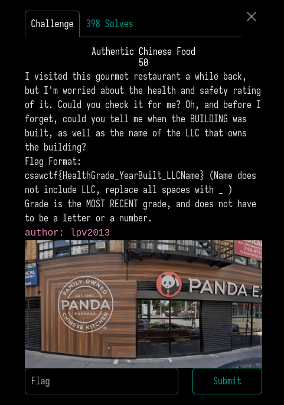

On the top right corner of the picture we can see a phone number, after a quick google search we realise the number is from NewYork.

We can then search on google maps "Panda Express New York" and we will find the one corresponding to the picture above.

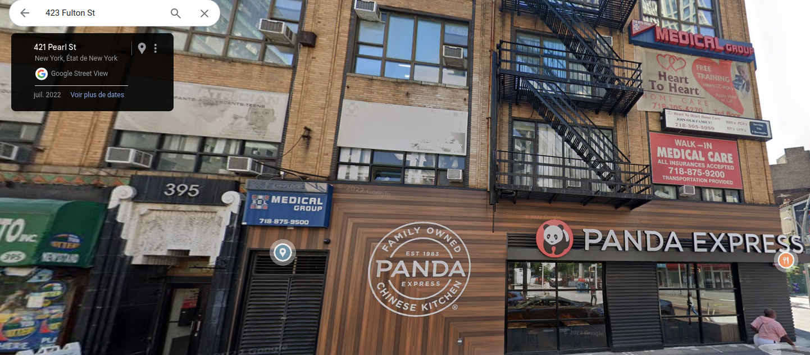

It's address is : 423 Fulton St, Brooklyn, NY 11201

### Healthgrade

On this website if we type the address of the restaurant we can find out its grade says pending, it turns out this was the first part of the flag:

https://a816-health.nyc.gov/ABCEatsRestaurants/#!/Search/50055636

### Year Built

On some websites it says the building was built in 1920 but if we look at this article about this particular building it says it was built in 1931:
https://www.brownstoner.com/architecture/building-of-the-day-423-fulton-street/

### LLC Name

On many different housing websites if we type this address we can see it's owned by BNN FULTON FLUSHING OWNER LCC
https://www.compass.com/building/423-fulton-st-brooklyn-ny-11201/293532309167074133/

### FLAG: 
```
csawctf{Pending_1931_Bnn_Fulton_Flushing_Owner}
```


# Rickshaw

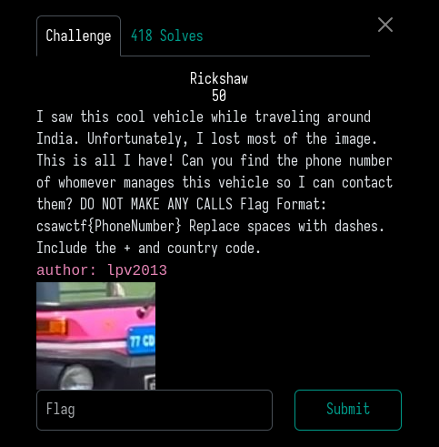

For this challenge we need to find the phone number of the owner of this vehicule.
After looking on google for the first 4 characters of this pressure plate we realise this rickshaw is owned by the US ambassy in India

https://www.licenseplatemania.com/landenpaginas/indie.htm

We can then type on google "pink rickshaw US ambassy India" and we find in the first results this facebook post of the US Indian ambassy:
https://www.facebook.com/India.usembassy/videos/the-auto-gang-of-the-us-embassy/839571310398639/

We then go on the facebook profile of the ambassy and we can find their phone number.

### Flag:
```
csawctf{+91-11-2419-8000}  
```


# Plane spotting

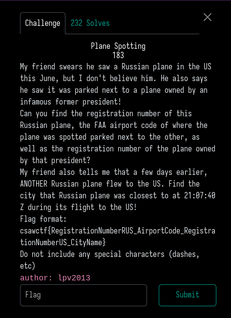

A google search about this incident brings us to this article:
https://meidasnews.com/news/trump-plane-seen-parked-next-to-russian-government-plane-for-two-days

### Registration number US
We get the information that the former president is Donald Trump and his airplane is the 'Trump force one', a google search gives us the registration number which is: N757AF and we can also easily find out that the model of the russian plane is IL-96-300.

### Airportcode

In the articles above we also find out that the airport where Trump's airplane was parked next to the russian airplane was the Washington-Dulles airport and its code is: IAD

### Registration number RUS
After searching a bit more we find this article talking about the Russian airplane with a tweet which shows the registration number:
https://dailywrap.uk/russian-planes-unexpected-visit-to-the-us-raises-questions,7043084396886145a

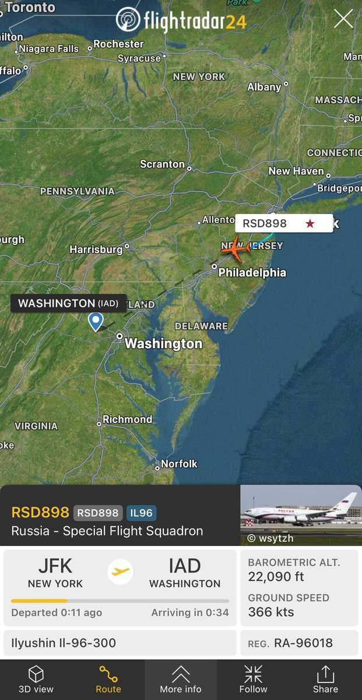

The registration number is RA-96018

### US city name

The challenge then talks about another russian airplane flew to the US.

After searching a bit more online I found this tweet which talked about another russian airplane which was in the US at the time as the incident:

https://x.com/MenchOsint/status/1806742133069738360?lang=sr

It's reg number is RA-96019, just one digit above the previous one.
I decide to look at it's flight history:

https://fr.flightaware.com/live/flight/RA96019/history
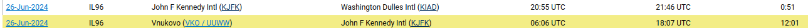

This plane was flying in the US at 21:07 so it it looks like I'm on right track, let's have a closer look at this.
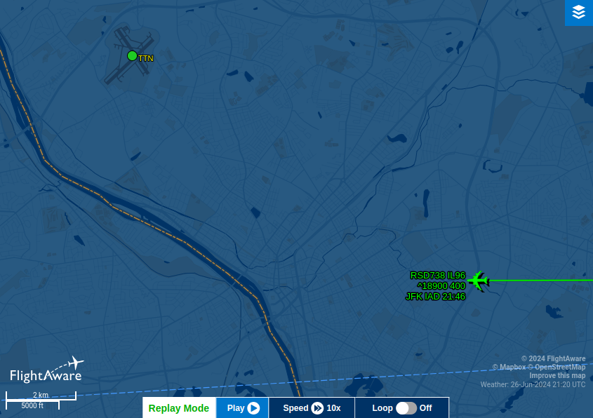

After looking at the plane's position on google maps we see that the nearest city is Trenton.

We combine all of these informations and we get the flag!

### Flag:
```
csawctf{RA96018_IAD_N757AF_Trenton}
```


# Literally 1984

This was probably the most controversial OSINT chall of this ctf, personally I liked it a lot and I found it pretty original.

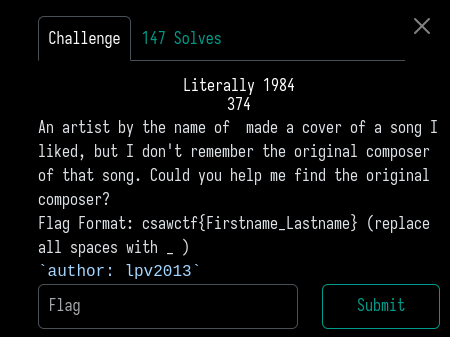

We don't have many informations with this description but if we look at the html code of the website we see something interesting:

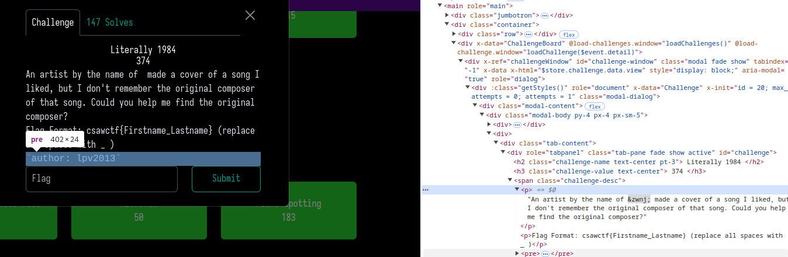

"&zwnj" is what we see between "name of" and "made a cover" in html.

If we search online this sequence of characters it brings us to this wiki page:
https://en.wikipedia.org/wiki/Zero-width_non-joiner

I then decided to search on youtube for singing related content using this sequence:
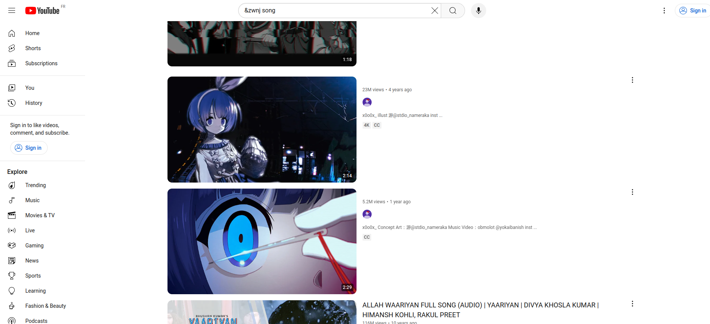
 
 In the first results we find a japanese singing channel which looks like it has no name and goes by the nickname x0o0x_:
 

On the popular videos of this channel we see a song called big brother, all of a sudden the name of the challenge makes much more sense.
https://www.youtube.com/watch?v=5lrseDtxX_E

We then look at the composer's name in the description of the video and we translate it in english which gives us our flag:

### Flag:
```
csawctf{Susumu_Hirasawa}
```


# Mystery

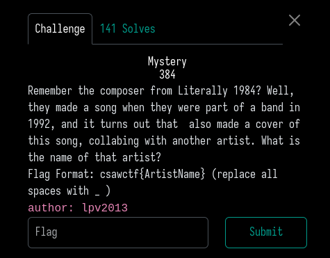

First we need to look at the band in which the producer was of in 1992, after looking at his wikipedia page we see that the band is called P-model.

https://en.wikipedia.org/wiki/Susumu_Hirasawa

After some more searching we see that the band only released one album in 1992 so what I did is searched every single song of this album on youtube followed by the previous chall's artist name which is x0o0x_

We then quickly find this song covered by x0o0x_ and another artist called Chogakusei.

https://www.youtube.com/watch?v=mI8KKipWEp4

### Flag:
```
csawctf{Chogakusei}
```
